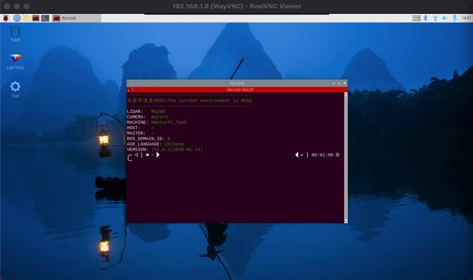
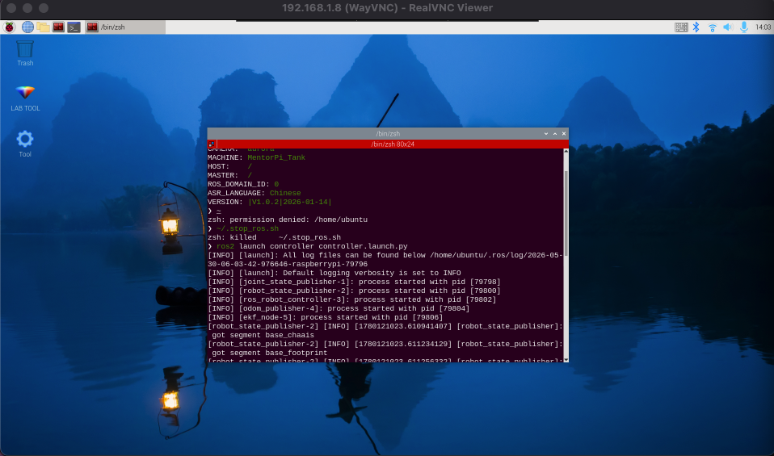
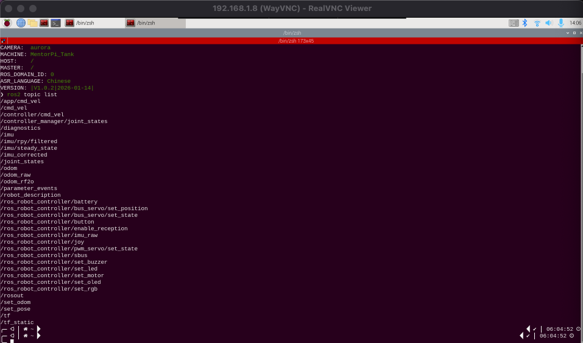
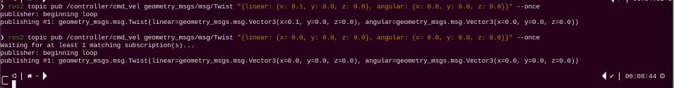
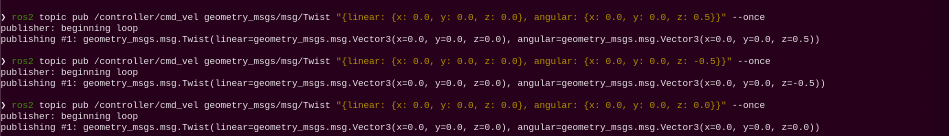
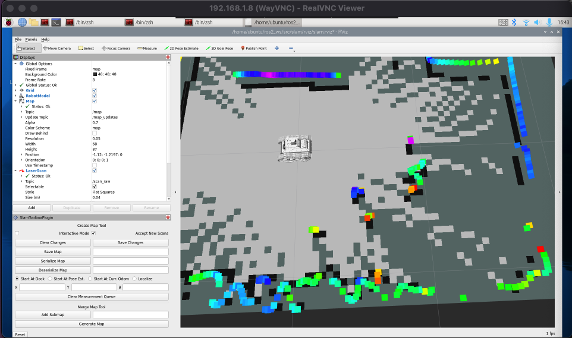
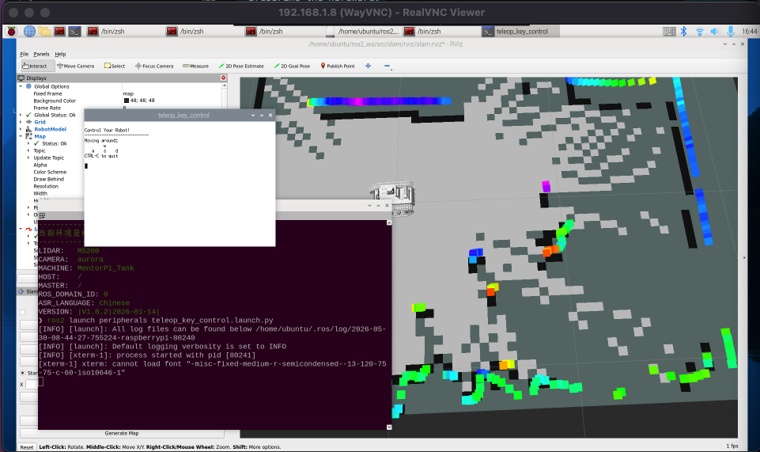
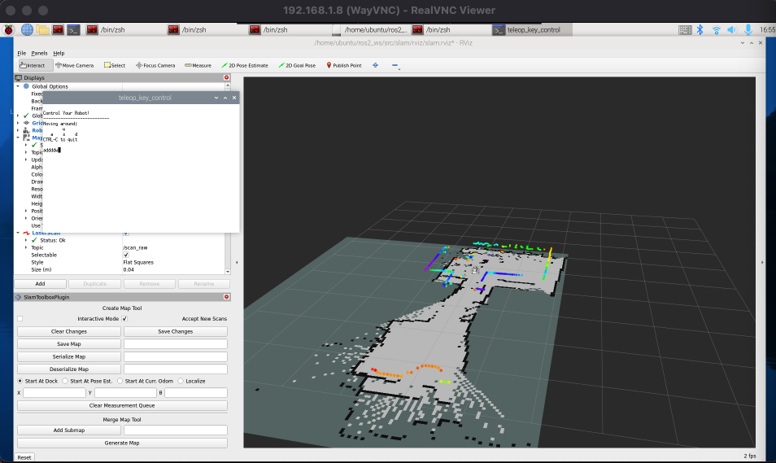
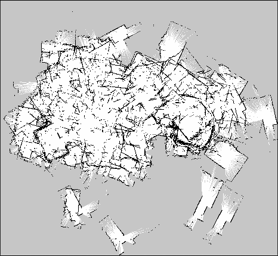
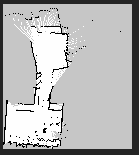

# MentorPi T1 Robotics Project

This repository documents my work with the **Hiwonder MentorPi T1** ROS2 tank robot.

The project focuses on practical robotics setup: remote access, ROS2 motion control, LiDAR-based SLAM mapping, RViz visualization, and preparation for autonomous navigation.

The goal is not only to run demo commands, but to document the full process of working with a real robot platform: connecting to it, controlling it through ROS2, collecting sensor data, building a map, and identifying the next steps toward navigation.

---

## Project Overview

The project is based on the **Hiwonder MentorPi T1**, a Raspberry Pi based ROS2 tank robot platform.

During the setup, the robot reported the following configuration:

```text
Current environment: ROS2
LIDAR: MS200
CAMERA: aurora
MACHINE: MentorPi_Tank
ROS_DOMAIN_ID: 0
VERSION: V1.0.2 | 2026-01-14
```

Main hardware and software used:

- Hiwonder MentorPi T1 tank robot
- Raspberry Pi onboard computer
- ROS2 environment
- MS200 LiDAR
- Aurora depth camera
- SSH remote access
- VNC remote desktop access
- RViz visualization
- ROS2 motion control and SLAM tools

---

## Documentation

The project is split into separate documentation files:

1. [Remote Access and Motion Control](src/01_remote_access_motion.md)
2. [LiDAR SLAM Mapping](src/02_slam_mapping.md)

---

## Stage 1: Remote Access and Motion Control

In the first stage, I configured remote access to the robot and tested manual movement control through ROS2.

Completed tasks:

- connected to the robot through its Wi-Fi access point
- configured the robot to connect to my home Wi-Fi network
- accessed the robot through SSH
- accessed the robot desktop through VNC
- launched the ROS2 motion control stack
- inspected ROS2 topics
- controlled the tank chassis by publishing `geometry_msgs/msg/Twist` messages
- tested forward movement and rotation
- recorded movement demo videos

Main ROS2 command topic used for movement:

```text
/controller/cmd_vel
```

Example movement command:

```bash
ros2 topic pub /controller/cmd_vel geometry_msgs/msg/Twist \
"{linear: {x: 0.1, y: 0.0, z: 0.0}, angular: {x: 0.0, y: 0.0, z: 0.0}}" --once
```

Demo videos:

- <video controls src="src/Video/1_Movement.MOV" title="[Forward movement video](src/Video/1_Movement.MOV)"></video>

- <video controls src="src/Video/2_Rotate.MOV" title="[Rotation video](src/Video/2_Rotate.MOV)"></video>

---

## Stage 2: LiDAR SLAM Mapping

In the second stage, I used the robot’s LiDAR to build a 2D occupancy grid map of a room.

Completed tasks:

- launched the ROS2 SLAM stack
- opened RViz for map visualization
- used keyboard teleoperation to drive the robot during mapping
- generated an occupancy grid map from LiDAR data
- saved the map as `.pgm` and `.yaml` files
- compared the first noisy mapping attempt with a smaller controlled mapping run
- selected the second map as the final result for this stage

SLAM launch command:

```bash
ros2 launch slam slam.launch.py
```

RViz launch command:

```bash
ros2 launch slam rviz_slam.launch.py
```

Map saving command:

```bash
ros2 run nav2_map_server map_saver_cli -f mentorpi_map_02 --ros-args -p map_subscribe_transient_local:=true
```

Final selected map:

```text
src/Screenshots/2_Mapping/Map/mentorpi_map_02.pgm
src/Screenshots/2_Mapping/Map/mentorpi_map_02.yaml
```

Mapping demo video:

- [LiDAR SLAM mapping video](src/Video/3_Mapping.mov)

---

## Results

### Remote access and ROS2 control

The robot was successfully connected to the local network and controlled remotely through SSH and VNC.



The ROS2 controller was launched manually:



Available ROS2 topics were inspected:



Manual movement commands were tested:





### SLAM mapping

RViz was used to visualize the robot, LiDAR scan data, and generated occupancy grid map.



The robot was driven manually during mapping:



The map was generated in RViz:



The first map was larger but noisy:



The final selected map was a smaller one-room map:



---

## What I Learned

During this project, I learned how to:

- connect to a real ROS2 robot over a local network
- use SSH and VNC for remote robotics development
- launch ROS2 nodes and inspect ROS2 topics
- control a robot by publishing `geometry_msgs/msg/Twist` messages
- understand the relationship between `/controller/cmd_vel` and physical movement
- use RViz to visualize robot state, LiDAR data, and maps
- run LiDAR-based SLAM on a real robot
- save occupancy grid maps with `map_saver_cli`
- compare mapping attempts and select the better result
- identify common SLAM and navigation issues, such as unstable localization and noisy maps

---

## Current Status

Completed:

```text
Remote access: done
SSH and VNC setup: done
ROS2 motion control: done
Manual movement test: done
Keyboard teleoperation: done
LiDAR SLAM mapping: done
Map saving: done
Final selected map: mentorpi_map_02
```

Partially tested:

```text
Navigation with saved map: started
Stable localization: not yet complete
Autonomous route following: not yet complete
```

Next steps:

```text
1. Improve map quality with a larger controlled mapping run.
2. Launch navigation using the saved map.
3. Set the initial pose in RViz with 2D Pose Estimate.
4. Send a short navigation goal.
5. Record a successful autonomous navigation demo.
6. Add navigation documentation as the next project stage.
```

---

## References

This project was based on the official Hiwonder MentorPi T1 documentation:

- https://docs.hiwonder.com/projects/MentorPi-T1/en/latest/
- https://docs.hiwonder.com/projects/MentorPi-T1/en/latest/docs/2.remote_tool_installation_and_container_access.html
- https://docs.hiwonder.com/projects/MentorPi-T1/en/latest/docs/3.motion_control_courses.html
- https://docs.hiwonder.com/projects/MentorPi-T1/en/latest/docs/6.mapping_courses.html
- https://docs.hiwonder.com/projects/MentorPi-T1/en/latest/docs/7.navigation_lesson.html